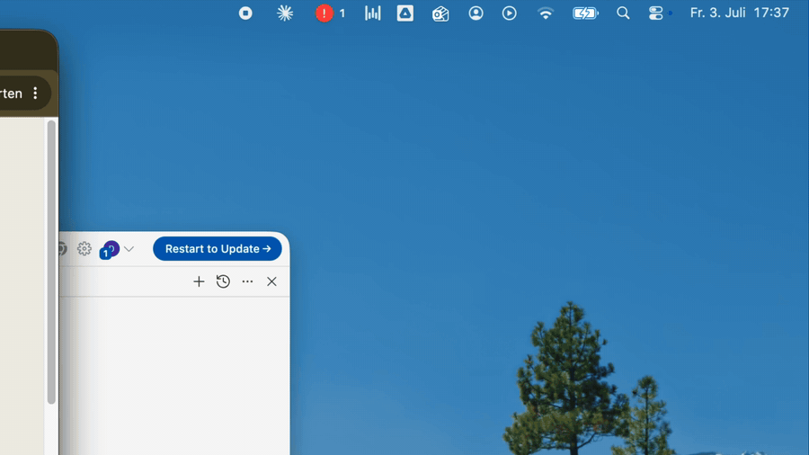

# ClaudeLights 

**A traffic light for your [Claude Code](https://claude.com/claude-code)
sessions, right in the macOS menu bar.**

Run Claude Code in three terminals and one glance tells you whether anything
needs you:    — click a
session to jump straight to its terminal window.



*[▶︎ Watch the 30-second intro](docs/media/hero.mp4)*


Native Swift. No Electron, no daemon, no network, no telemetry — just Claude
Code hooks writing a JSON file and a menu bar app watching it. macOS 13+.

## Install

1. **Download** the latest `ClaudeLights.dmg` from
   [Releases](https://github.com/tokyn-studio/claude-lights/releases) and drag
   the app to Applications
   *(or `brew install --cask tokyn-studio/tap/claudelights`)*.
2. **Open ClaudeLights** and click **Install Hooks** in the welcome window.
3. **Restart** any running Claude Code sessions. That's it.

The installer adds a few hook entries to `~/.claude/settings.json` (a
timestamped backup is kept, and everything else in the file is preserved).
Uninstalling them is one click in Settings.

## Features

- **Five states** at a glance:     .
  With parallel sessions the icon shows the *worst* state, so red always wins.
- **Click a session → jump to its terminal**: focuses the exact window/tab in
  Terminal.app and iTerm2 (via the session's tty), activates the right app
  elsewhere (VS Code, Cursor, Ghostty, WezTerm, Warp, kitty, Alacritty, …).
- **Desktop notifications** per state, debounced against rapid flips, with an
  optional sound when a session needs input.
- **Work timers**: live active-time stopwatch per session that pauses while
  Claude waits for you.
- **Usage**: today's token counts (input / output / cache) read from Claude
  Code's own transcripts, plus time spent per state.
- **History** of recent state transitions.
- **Demo session** in the welcome window — see the traffic light work before
  wiring up anything real.
- **Auto-updates** via Sparkle, **Start at Login**, full uninstall.

## How it works

```
Claude Code ──hook events──► claudelights-hook ──► ~/.claude/claudelights-status.json ──► ClaudeLights.app
              (per session)   (tiny bundled CLI,     (one entry per session_id)            (fs watcher → menu bar)
                               no dependencies)
```

1. Claude Code fires [hooks](https://docs.anthropic.com/en/docs/claude-code/hooks)
   (`UserPromptSubmit`, `PostToolUse`, `Stop`, `PreCompact`, `Notification`,
   `SessionEnd`). Each runs `claudelights-hook`, a small compiled helper the
   app installs to `~/Library/Application Support/ClaudeLights/` — no jq, no
   scripts, ~10 ms per event.
2. The helper merges **only that session's entry** into the shared status
   file (atomic write + file lock, so parallel sessions never clobber each
   other).
3. The app watches the file with a real filesystem watcher (`DispatchSource`,
   not polling) and updates the icon within moments. It's a menu-bar-only
   agent (`LSUIElement`) — no Dock icon.

The app self-heals: after every update it re-installs the helper binary if it
changed, and Settings shows repair/migrate actions if the wiring ever drifts.

## Requirements

- macOS 13 (Ventura) or later.
- [Claude Code](https://claude.com/claude-code).

That's the whole list — the hook helper is bundled and dependency-free.

<details>
<summary><strong>Manual hook wiring (without the in-app installer)</strong></summary>

The app's **Install Hooks** button writes exactly the entries in
[`settings.snippet.json`](settings.snippet.json). To wire them by hand, run
ClaudeLights once (so it installs the helper binary to
`~/Library/Application Support/ClaudeLights/`), then merge that snippet into
your `~/.claude/settings.json` and restart your Claude Code sessions.

The legacy jq-based shell hooks in `hooks/` still work and remain for CI and
scripting (`hooks/working.sh` etc. — they need `jq`), but they are deprecated
for end users; the in-app installer migrates old wiring automatically.

Environment overrides (mainly for testing):

| Variable                     | Purpose                                     | Default                              |
| ---------------------------- | ------------------------------------------- | ------------------------------------ |
| `CLAUDELIGHTS_STATUS_FILE`   | Status file path (helper + legacy hooks).   | `~/.claude/claudelights-status.json` |
| `CLAUDELIGHTS_SETTINGS_FILE` | settings.json path (in-app installer).      | `~/.claude/settings.json`            |
| `CLAUDELIGHTS_HELPER_DIR`    | Helper install dir (in-app installer).      | `~/Library/Application Support/ClaudeLights` |

Note: the GUI app cannot see a `CLAUDE_CONFIG_DIR` exported in your shell —
if you use one, point `CLAUDELIGHTS_SETTINGS_FILE` at its `settings.json`.

</details>

<details>
<summary><strong>Status file format</strong></summary>

`~/.claude/claudelights-status.json` is a JSON object keyed by `session_id`:

```json
{
  "aaaaaaaa-1111-2222-3333-444444444444": {
    "state": "working",
    "session_id": "aaaaaaaa-1111-2222-3333-444444444444",
    "project": "frontend",
    "cwd": "/Users/me/projects/frontend",
    "term": "iTerm.app",
    "tty": "ttys003",
    "started": "2026-07-01T14:46:36Z",
    "active_seconds": 0,
    "timestamp": "2026-07-01T14:46:36Z"
  }
}
```

States: `working`, `compacting`, `done`, `needs_input`. Sessions are removed
on `SessionEnd` and expire after 2 hours without updates. Extra best-effort
fields (`bundle_id`, `tmux_pane`, `wezterm_pane`, `kitty_window_id`,
`kitty_listen_on`) identify the hosting terminal/IDE for window focusing.

You can drive everything manually — handy for testing:

```sh
export CLAUDELIGHTS_STATUS_FILE="$(mktemp -d)/status.json"
HOOK="$HOME/Library/Application Support/ClaudeLights/claudelights-hook"
echo '{"session_id":"A","cwd":"/tmp/frontend"}' | "$HOOK" working
echo '{"session_id":"A","cwd":"/tmp/frontend"}' | "$HOOK" needs_input
cat "$CLAUDELIGHTS_STATUS_FILE"
```

</details>

<details>
<summary><strong>Build from source</strong></summary>

With full Xcode (required for a proper `.app` with notifications/login item):

```sh
open ClaudeLights.xcodeproj   # Product ▸ Run (⌘R)
# or:
xcodebuild -project ClaudeLights.xcodeproj -scheme ClaudeLights -configuration Release build
```

Quick local build with only the Command Line Tools:

```sh
scripts/dev-build.sh --run    # builds build/ClaudeLights.app (ad-hoc signed)
```

Tests:

```sh
scripts/test-hook-parity.sh <path-to-claudelights-hook>   # helper vs legacy shell hooks
scripts/test-hook-installer.sh                            # settings.json merge/backup/migration
```

The project builds with ad-hoc signing out of the box; no Apple Developer
account needed to run locally.

</details>

<details>
<summary><strong>Distribution (signed DMG, Sparkle, Homebrew)</strong></summary>

ClaudeLights ships as a signed, notarized `.dmg` — not through the Mac App
Store, which requires App Sandbox (this app deliberately needs unrestricted
access to `~/.claude/`). Hardened Runtime is enabled.

One-time setup: full Xcode, an Apple Developer Program membership with a
*Developer ID Application* certificate, and stored notarization credentials:

```sh
xcrun notarytool store-credentials claudelights \
  --apple-id "you@example.com" --team-id "YOURTEAMID" \
  --password "app-specific-password"
```

Cut a release:

```sh
TEAM_ID=YOURTEAMID scripts/release.sh   # archive, export, DMG, notarize, staple
scripts/sparkle-appcast.sh build        # sign the update → build/appcast.xml
```

Then create a GitHub Release and upload **both** `ClaudeLights.dmg` and
`appcast.xml`. Installed apps auto-update from the latest release (the Sparkle
feed URL points at `releases/latest/download/appcast.xml`; the public EdDSA
key lives in `Info.plist`).

`release.sh` also writes `build/claudelights.rb` — the filled-in Homebrew cask
(source template: `packaging/homebrew/claudelights.rb`). Copy it into the tap
repo (`tokyn-studio/homebrew-tap`, as `Casks/claudelights.rb`) and push.

</details>

<details>
<summary><strong>Project layout</strong></summary>

```
claude-lights/
├── ClaudeLights/                  # The menu bar app (AppKit + SwiftUI popover)
│   ├── main.swift                 # Entry point (.accessory activation policy)
│   ├── AppDelegate.swift          # Wires watcher + store + model + services
│   ├── Models.swift               # SessionState / SessionStatus + severity
│   ├── SessionStore.swift         # Parsing, worst-state, stale cleanup, transitions
│   ├── HookInstaller.swift        # settings.json merge/backup/repair/uninstall
│   ├── OnboardingView.swift       # First-run welcome window
│   ├── DemoSession.swift          # Simulated session for the welcome window
│   ├── FileWatcher.swift          # DispatchSource file watcher
│   ├── PanelView.swift            # Popover: sessions, usage, history, settings
│   ├── StatusController.swift     # NSStatusItem icon + popover
│   ├── TerminalLauncher.swift     # Focuses the session's terminal window
│   └── …                          # Preferences, notifications, Sparkle, …
├── ClaudeLightsHook/              # The bundled hook helper CLI (no dependencies)
├── hooks/                         # Legacy jq-based shell hooks (deprecated)
├── scripts/                       # dev-build, release, DMG, appcast, tests
├── packaging/homebrew/            # Cask template
├── tests/                         # Headless fixture tests
└── settings.snippet.json          # Manual hook wiring (fallback)
```

</details>

## Internationalization

All UI strings go through a String Catalog (`Localizable.xcstrings`) with an
English base; timestamps use locale-aware formatters throughout.

---

*ClaudeLights is an independent project, not affiliated with or endorsed by
Anthropic. "Claude" and "Claude Code" are trademarks of Anthropic, PBC.*
